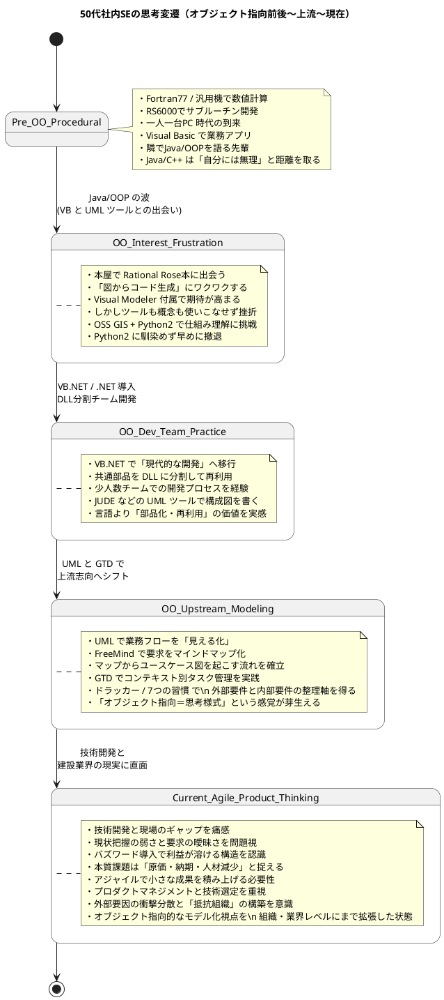
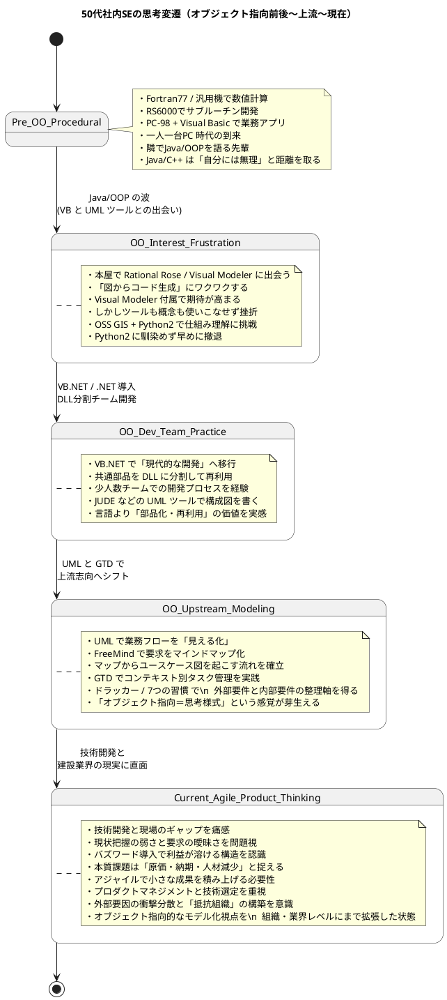
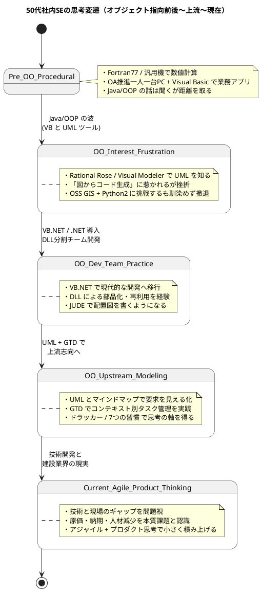

- 小学生の時に、市の図書館にパソコンの単行本があり、サンプルコードを、本の付録についていた紙のキーボードで、打ち込んで遊んでいた
	- キーボードに憧れがあったのかな、かちゃかちゃ打つ音を想像してた
- 兄が買ってもらったPC9801VMというパソコンで、ソーサリアンというRPGをやっていた
	- 当時は、パソコンソフトのレンタルがあり、コピーするためのソフトウェアもレンタルしていた。FZ-Copyとかウィザードとかいう名前だった
	- 本屋では、フリーソフト・シェアソフトウェアをCDに入れた本を売っていた。**ソフト＆シェアウェアpack 2000**　は、試すのが楽しかった。
- プログラミングは、大学の課外授業で、Fortran77 を、日立系の汎用機をVT100というビデオ端末で操作して実行するのを受けたことがある
	- 校内では、PC9801NCというノートパソコンを売っていて、40万前後だったような気がする
- 入社後は、IBMのRS6000で、Fortanでサブルーチンを作る手伝いと、日立系の汎用機へ計算ジョブの投入を行なっていた
- ちょうど、OAブームで、入社後２−３年後には一人一台パソコン配備のいい環境になる。Visual Basic を使い始めた。
- 入社後は、5-6年で、Java好きの先輩が配属され、オブジェクト指向プログラミングを私の横で唱え始めた
	- ただ私には、JavaもC++も、見ただけで無理と、勉強する気になれなかった
- Visual Basicの情報は、本屋さんにしかなくよく通っていた時に、Rational Roseというモデリングツールの本を見つけた。
	- ソースコードを書く前に設計図を描く、あるいは **コードから図を生成する** という、魔法のツールだった。この時がUML知った時期である。買える訳もなく付属の体験版がついた書籍、**VBプログラマのためのUML：Visual Modeler / Rational Roseを使ったソフトウェアデザイン** で、図からコード生成する機能もあり興奮してた。スケルトンコードだったが。
	- さらにその頃に、Visual Basicに、Microsoft Visual Modeler というRational Roseのサブセット版が付属するようになった。
		- ただ、これも私には使いこなせず、オブジェクト指向に興味があり知りたいのに、知識にならなかったグズグズとして頃であった。
- その頃、OSSのGIS（地理情報システム）というものを使い始め、プラグインがPythonであったために、仕組み理解をする気が始めて起きたが、Python2は馴染めず割とはやく諦めた
	- その後、QGIS3で、Python3ネイティブになり、Pythonを学び始めたが、オブジェクト指向の習得などには辿り着けなかった
- VB.NETがリリースされ、.NET 1.0 で、現代的なプログラミングに移行するきっかけを得た。.NET 2.0 になりこれを業務で使うようになった
	- 部品の再利用が便利なことに気づき、４名ほどで、DLLに分割して機能を作る体制で取り組んだのは、システム開発っぽい体制ができて良かった。
	- 配置図などを、Javaで動く、JUDEというUMLツールが無償で使えたので書いていた気がする。
- UMLをきっかけに、ビジュアルな表現による業務整理に目覚め、自分へのGTDの導入は、チームを引っ張る立場になったこともあり、とても有効的であった。
	- UMLを描くにあたって、マインドマップによるユーザ要求の可視化に取り組んだ気がする。FreeMindがすでにあったので、漠然としてアイデア出しの可視化に使い、そこから共通項や例外を、ユースケース図に落とす流れによく取り組んだ。
- GTDに取り組んだことで、すぐにやること、いつかやること、依頼すること、場所、出かけた時、などコンテキスト（状況）に合わせた実施項目を管理することは、頭の中の空っぽ化の気持ちよさに、今でも取り組んでいる。
- 同時に、この頃は、もしドラで有名になったピーター・ドラッガーの「マネジメント」と、コビィーの「7つの習慣」もよく読んだ
	- この2つを学んだことで、外部要件の分析と内部要件（自分の管理すべきこと）の分析の向き合い方が掴めた気がする。
- 2000年以降は、技術開発に軸足が移っていったこともあり、建設業界の自動ドアの内側と外側（別記事に内容記載）のギャップから、アジャイルで取り組む必要性があった
	- 現状の問題把握が希薄で、要求仕様が曖昧になり、アウトカムよりアウトプット重視の開発目標を掲げるため、成果物のインパクトと賞味期限が短くなった
	- 本質的な課題は、現代的な問題ではなく、原価と納期であることは変わらず、外部要因として物価高騰、人件費高騰、職場離れによる次世代人材減少による、経験値バンクの縮小やノウハウ継続の危機による競争力の低下である
	- これを政府方針（特に国土交通省）の意向を真っ先に反映させなければならない建設業界が、バズワードに踊らされ、学問的背景の乏しい技術適用を現場実装することに追われて、利益の一部を実のならない技術開発に溶かしている
	- アジャイルで取り組まなければならないのは、本質的な要求仕様の明確化と可視化、いつ何を取り組むべきかのプロダクトマネジメントと選定する技術も含めたリソース選択、小さな成果の積み上げによる、外部要因によるインパクトの衝撃分散と抵抗組織の構築などのためである

